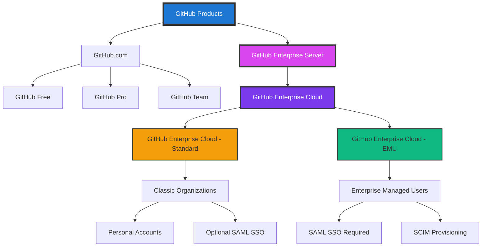

A comprehensive guide to GitHub's enterprise offerings and how to choose the right platform for your organization.

---

## GitHub Product Offerings

### 1. GitHub Enterprise Cloud

**Description:** Enterprise features delivered on GitHub's public cloud platform.

**Key Characteristics:**
- **Infrastructure:** GitHub's shared cloud infrastructure (github.com)
- **Management:** Fully managed by GitHub
- **Target Audience:** Organizations wanting enterprise features with minimal operational overhead

**Benefits:**
- No infrastructure management required
- Automatic updates and maintenance
- Built-in high availability and disaster recovery
- Access to the full GitHub ecosystem
- Seamless integration with GitHub Marketplace

---

### 2. GitHub Enterprise Cloud with EMU (Enterprise Managed Users)

**Description:** Enterprise Cloud with centrally managed user identities.

**Key Characteristics:**
- **Infrastructure:** GitHub's shared cloud infrastructure (github.com)
- **Management:** Fully managed by GitHub, users managed by enterprise
- **Target Audience:** Organizations requiring complete user lifecycle control and restricted collaboration

**Benefits:**
- Centralized identity and access management
- Complete control over user provisioning and de-provisioning
- Enhanced security through identity provider integration
- Restricted external collaboration
- Compliance-friendly architecture

---

### 3. GitHub Enterprise Server

**Description:** Self-hosted GitHub instance on customer infrastructure.

**Key Characteristics:**
- **Infrastructure:** Customer's own servers, private cloud, or data centers
- **Management:** Customer-managed (updates, maintenance, security)
- **Use Case:** Organizations requiring complete data control or air-gapped environments

**Benefits:**
- Complete data sovereignty
- Customizable to specific compliance requirements
- Can operate in air-gapped environments
- Full control over infrastructure and security
- Integration with on-premises systems

---

## Platform Comparison

### GitHub Enterprise Cloud

| Aspect | Details |
|--------|---------|
| **User Control** | Users manage their own accounts |
| **External Access** | Users can collaborate outside organization |
| **Profile Ownership** | Personal GitHub profiles allowed |
| **Identity Management** | GitHub accounts + SSO integration |
| **Collaboration** | Open collaboration across GitHub |
| **Infrastructure** | GitHub-managed cloud |
| **Updates** | Automatic, managed by GitHub |
| **Data Location** | GitHub's cloud infrastructure |
| **Customization** | Limited to organization settings |

### GitHub Enterprise Cloud with EMU

| Aspect | Details |
|--------|---------|
| **User Control** | Enterprise IT manages all accounts |
| **External Access** | Completely restricted to enterprise only |
| **Profile Ownership** | Enterprise-owned accounts only |
| **Identity Management** | Fully integrated with enterprise IdP |
| **Collaboration** | Limited to enterprise repositories only |
| **Infrastructure** | GitHub-managed cloud |
| **Updates** | Automatic, managed by GitHub |
| **User Lifecycle** | Centrally controlled via SCIM |
| **Security** | Enhanced isolation and control |

### GitHub Enterprise Server

| Aspect | Details |
|--------|---------|
| **User Control** | Managed by customer's authentication system |
| **External Access** | Completely isolated |
| **Profile Ownership** | Configured by customer policy |
| **Identity Management** | Customer's identity provider (LDAP, AD, etc.) |
| **Collaboration** | Only within customer-created repositories |
| **Infrastructure** | Customer-managed |
| **Updates** | Manual, customer-controlled |
| **Data Location** | Customer's data center/cloud |
| **Customization** | Extensive customization options |

---

## Decision Matrix

### Choose GitHub Enterprise Cloud When:

✅ You want enterprise features with minimal complexity

✅ Users need to collaborate with external developers

✅ Open-source contribution is encouraged or required

✅ Rapid deployment and scaling are priority

✅ Limited IT operations team

✅ You want to leverage GitHub's global infrastructure

✅ Automatic updates and maintenance are preferred

**Best For:** 
- Technology companies
- Startups scaling to enterprise
- Organizations with distributed teams
- Companies emphasizing open collaboration

---

### Choose GitHub Enterprise Cloud with EMU When:

✅ You need complete control over user accounts

✅ Regulatory compliance requires isolated environments

✅ External collaboration must be prevented

✅ You want centralized identity lifecycle management

✅ Data governance is a top priority

✅ You operate in highly regulated industries (finance, healthcare, government)

✅ Need to enforce strict access policies

✅ Require audit trails for all user activities

**Best For:**
- Financial services institutions
- Healthcare organizations (HIPAA compliance)
- Government agencies
- Companies with strict data governance requirements
- Organizations in regulated industries

---

### Choose GitHub Enterprise Server When:

✅ You need complete data sovereignty

✅ Air-gapped environment is required

✅ Custom compliance requirements exist

✅ You have dedicated infrastructure team

✅ Integration with on-premises systems is critical

✅ Specific data residency requirements must be met

✅ Need to operate in disconnected environments

✅ Require extensive customization and control

**Best For:**
- Defense and intelligence agencies
- Organizations with air-gapped requirements
- Companies with data sovereignty mandates
- Enterprises with existing on-premises infrastructure
- Industries with strict compliance requirements

---

## Visual Hierarchy



*GitHub product offerings showing the relationship between GitHub.com, Enterprise Cloud (Standard and EMU), and Enterprise Server.*

### Text-Based Hierarchy

<details>
<summary>Click to expand text version</summary>

```
GitHub Products
├── GitHub.com
│   ├── GitHub Free
│   ├── GitHub Pro
│   └── GitHub Team
│
└── GitHub Enterprise Server
    │
    └── GitHub Enterprise Cloud
        │
        ├── GitHub Enterprise Cloud - Standard
        │   └── Classic Organizations
        │       ├── Personal Accounts
        │       └── Optional SAML SSO
        │
        └── GitHub Enterprise Cloud - EMU
            └── Enterprise Managed Users
                ├── SAML SSO Required
                └── SCIM Provisioning
```
</details>

### Feature Availability Matrix

| Feature | Enterprise Cloud | Enterprise Cloud EMU | Enterprise Server |
|---------|-----------------|---------------------|-------------------|
| SAML SSO | ✅ Optional | ✅ Required | ✅ Supported |
| SCIM Provisioning | ✅ Optional | ✅ Required | ✅ Supported |
| Managed Users | ❌ | ✅ | ⚙️ Configurable |
| External Collaboration | ✅ | ❌ | ⚙️ Configurable |
| GitHub Actions | ✅ | ✅ | ✅ |
| Advanced Security | ✅ | ✅ | ✅ |
| Self-Hosted Runners | ✅ | ✅ | ✅ |
| Custom Domain | ❌ | ❌ | ✅ |
| Air-Gapped Support | ❌ | ❌ | ✅ |
| Data Residency Control | ❌ | ❌ | ✅ |
| IP Allowlists | ✅ | ✅ | ✅ |
| Audit Log API | ✅ | ✅ | ✅ |

---

## Migration Considerations

### Moving Between Platforms

**From Enterprise Cloud to EMU:**
- Requires organization recreation
- User accounts must be recreated
- Repositories can be transferred
- Careful planning for identity migration needed

**From Enterprise Server to Enterprise Cloud:**
- Data migration tools available
- Consider phased migration approach
- Plan for identity system integration
- Evaluate external collaboration needs

**From Enterprise Cloud to Enterprise Server:**
- Requires infrastructure setup
- Plan for ongoing maintenance
- Consider total cost of ownership
- Evaluate staffing requirements

---

## Cost Considerations

### Enterprise Cloud
- **Pricing Model:** Per-user, per-month
- **Included:** Hosting, maintenance, updates, support
- **Scalability:** Pay-as-you-grow
- **Hidden Costs:** Minimal operational overhead

### Enterprise Cloud with EMU
- **Pricing Model:** Per-user, per-month (premium tier)
- **Included:** All Enterprise Cloud features + EMU capabilities
- **Additional Costs:** Identity provider integration
- **Value:** Enhanced security and compliance

### Enterprise Server
- **Pricing Model:** License-based (annual)
- **Additional Costs:** Infrastructure, maintenance, staffing
- **Ongoing Expenses:** Updates, security patches, monitoring
- **Total Cost:** Higher operational overhead

---

## Getting Started

### Next Steps for Each Platform

**Enterprise Cloud:**
1. Sign up for GitHub Enterprise trial
2. Configure organization settings
3. Set up SSO (optional)
4. Invite team members
5. Create repositories and start collaborating

**Enterprise Cloud with EMU:**
1. Contact GitHub Sales for EMU setup
2. Configure identity provider integration
3. Set up SCIM provisioning
4. Define access policies
5. Provision managed users
6. Migrate repositories

**Enterprise Server:**
1. Review system requirements
2. Provision infrastructure
3. Install GitHub Enterprise Server
4. Configure authentication
5. Set up backup and monitoring
6. Migrate data and train administrators

---

## Additional Resources

- [GitHub Enterprise Documentation](https://docs.github.com/enterprise)
- [GitHub Enterprise Cloud vs Server Comparison](https://docs.github.com/enterprise-cloud@latest/admin/overview/about-github-for-enterprises)
- [EMU Documentation](https://docs.github.com/enterprise-cloud@latest/admin/identity-and-access-management/using-enterprise-managed-users-for-iam)
- [GitHub Enterprise Server Admin Guide](https://docs.github.com/enterprise-server@latest/admin)

### Related Documentation

- Review [Organization & Enterprise Best Practices]({{ '/docs/organization-enterprise-practices' | relative_url }})
- Explore [Repository Best Practices]({{ '/docs/repository-best-practices' | relative_url }})
- Understand [Collaboration]({{ '/docs/collaboration' | relative_url }})
